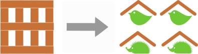
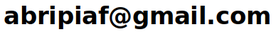

## Qu'est ce qu'abripiaf ?
Abripiaf a un double objectif : recycler des déchets bois (planche/palettes) en les transformant en abris pour oiseaux (passereaux,rapaces...) et petits mammifères (hérisson, écureuil...).

_Abripiaf n'a pas de but lucratif , ne (re)vend et n'achète rien_.

## Quelles sont les réalisations ?
voir la page [realisation](./realisation.html).

## Comment aider Abripiaf ?
voir la page [aide](./aide.html).

## Contact

